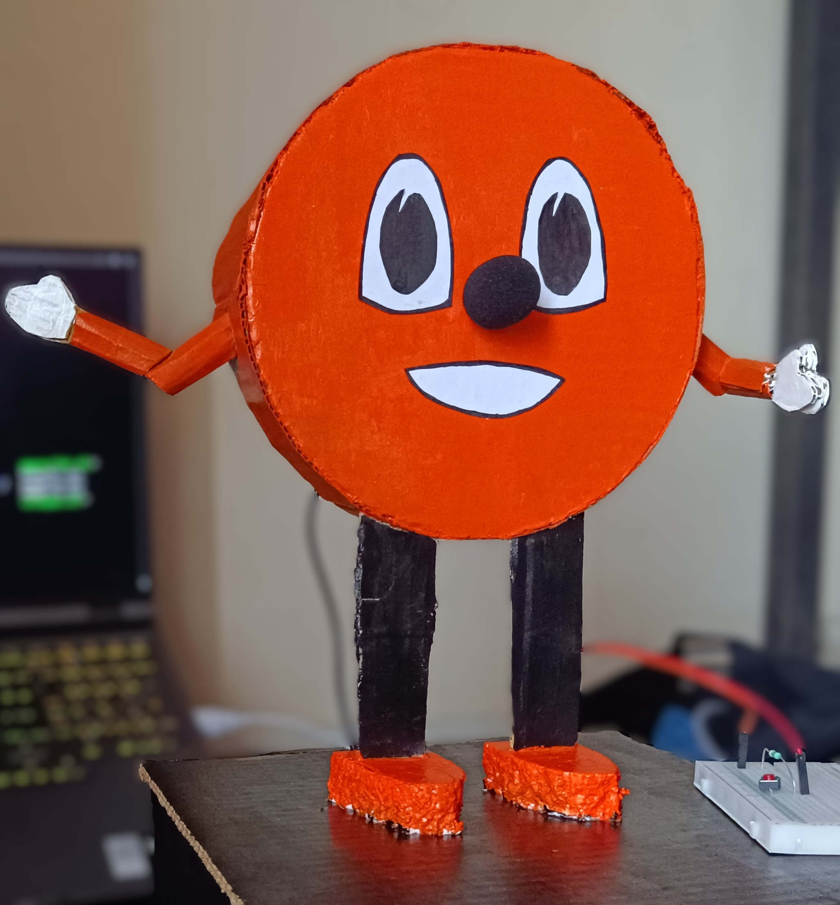
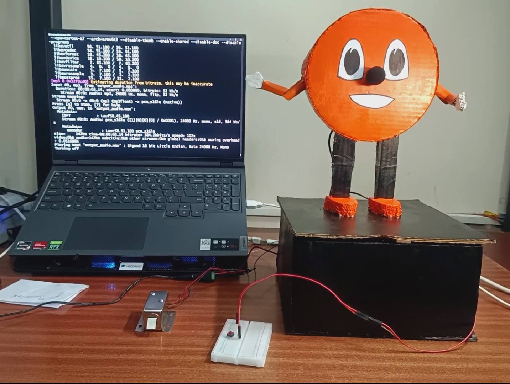
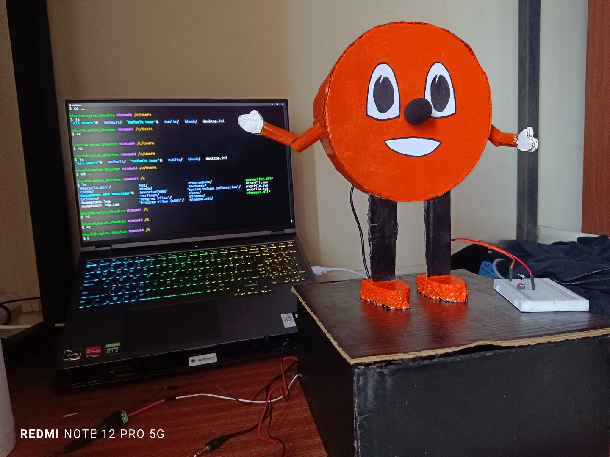
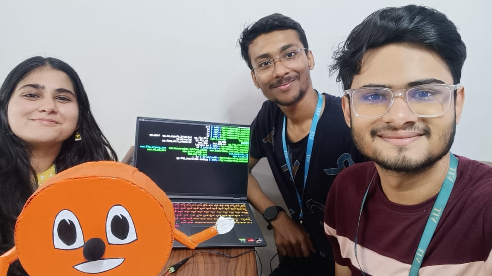

# `Miss Minutes` Autonomous Voice Assistant and Smart Home Integration

&nbsp; &nbsp; &nbsp;
This repository contains the python source code and requirements for the project <u>Miss Minutes</u> created under subject  MPMC <i>(Micro-processors and Micro-controllers)</i>.

## Description
  
- Miss minutes is an autonomous and standalone voice assistant. She is inspired from exactly what the name suggests, famous character from Loki.  

- Ms Minutes can provide you any information like:
  * Answer questions on a variety of topics
  * Provide weather updates
  * Perform arithmetic calculations
  * Provide definitions and explanations
  * Engage in casual conversations
  
- Apart from interactions, Ms Minutes can automate you environment / home like:
  * Providing voice-activated control for various home automation scenarios
  * Controlling lights and other smart appliances

## Table of Contents

- [`Miss Minutes` Autonomous Voice Assistant and Smart Home Integration](#miss-minutes-autonomous-voice-assistant-and-smart-home-integration)
  - [Description](#description)
  - [Table of Contents](#table-of-contents)
  - [Features](#features)
  - [Tech-Stack 💻](#tech-stack-)
  - [Links](#links)
  - [Team-mates](#team-mates)
  - [Contributions](#contributions)
    - [Contact](#contact)


## Features

   1. **Voice Interactions**   
      User input is taken by voice commands and response is provide back in speech.

   2. **Weather Information**    
      Ms Minutes can provide you with current weather information as well.

   3. **Home Automation**   
      The project demonstrates controlling one solenoid latch from voice commands, using action commands like 'open the lock', 'close the lock' etc.
      
      
   4. **AI Solutions**   
      Unlike traditional assistants, Ms Minutes is integrated with ChatGPT API, and hence, can provide better interactions and results.

   5. **Standalone Nature**   
      Deployed on Raspberry Pi Zero 2-W, Ms Minutes is a standalone assistant which can be taken anywhere and started just with one adapter input.

      <!--  -->


## Tech-Stack 💻
   - Python
   - ChatGPT API
   - Bash (Linux)

## Links

1. Clone the repository:
    ```bash
    git clone https://github.com/Bbs1412/Ms_Minutes

    cd Ms_Minutes
    ```

1. Video demonstration of project:
   [Redirect to LinkedIn](https://www.linkedin.com/posts/bhushan-songire_voiceassistant-raspberrypi-techprojects-activity-7142895488197951490-R7Kh?utm_source=share&utm_medium=member_desktop) 
  

## Team-mates 

   1. Bhushan Songire
   2. Bhavyata Kaur
   3. Abhijeet Soni
   
   
   
## Contributions  

   Any contributions or suggestions are welcome! 

### Contact

   - **Email** - [bhushanbsongire@gmail.com](bhushanbsongire@gmail.com)
   - **LinkedIn** - [/bhushan-songire](https://www.linkedin.com/in/bhushan-songire/)


<!-- ## Acknowledgments -->
   <!-- - Thanks to .. for ... -->
